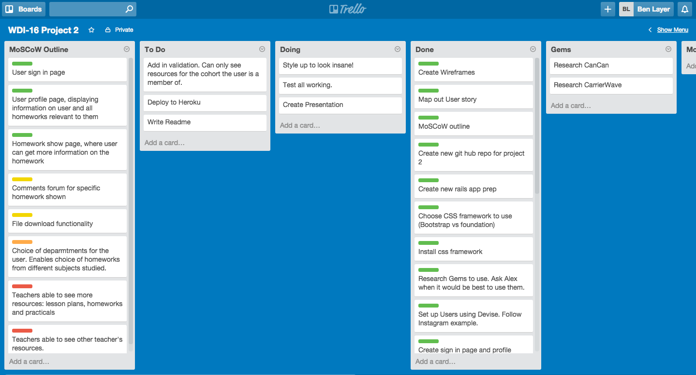
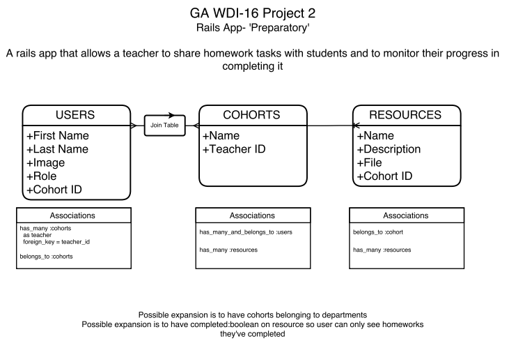
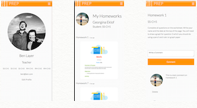
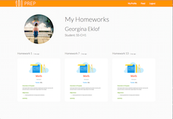

# wdi-project-2
WDI-16 Project 2. Build a full stack Rails app.
***

# PREP

##Main Idea

An application which allows a teacher to share homeworks with their students and monitor their progress through a homework-specific discussion forum.

###Motivation

A buzzword in education is 'dfferentiation'. It is easy for a teacher to give a lesson to a class, it is much harder for a teacher, in that same time period, to give 20 different lessons tailored to each student. This however is in essence what is meant by differentiation. It is incredibly important and often what can take the OFSTED rating of a school's  teaching quality from good to outstanding.
In order to differentiate a a teacher must know the ability and progression of each student they teach. This is achieved in part through the marking of homework. There is however a flaw in this as homework may not acutally be a student's work or the teacher may not being full attention to their marking due the other admin tasks that feature on their overly long to-do list.
The aim of this application then is to help a teacher monitor a student's progress real time. By providing a central location for all  student's to access their homework, the opportunity is created for a comment forum to be generated where student's can ask questions and raise points about the work as they go along. This allows a teacher to see straight away the common problems in the class and specific problems related to each student. Incredibly valuable information in the pursuit of meaningful differentiation in the classroom.

###MoSCoW Design

- Must have
	- User sign in page
	- User profile page, displaying information on user and all homeworks relevant to them
	- Homework show page, where user can get more information on the homework

- Should have
	- Comments forum for specific homework shown
	- File download functionality

- Could have
	- Choice of deparmtments for the user. Enables choice of homeworks from different subjects studied.

- Won't have
	- Teachers able to see more resources: lesson plans, homeworks and practicals
	- Teachers able to see other teacher's resources.

### User Story and Wireframes

Wireframes were created using popapp (https://popapp.in/).

1. User is greeted by sign-in page (if not logged in)
2. After logging in, or if already logged in, user is directed to their profile page.
3. User can choose a homework that has been set.
4. User is directed to homwork show page where further information about the homework is displayed. User can download homework.
5. If the user is struggling with the homework they can switch to the forum page by using the drop down menu.
6. On forum page user can post comments/questions about the homework.

User can always be taken back to profile page by clicking on name at the top.

User can sign out by clicking on logout button.

Wireframes mock-ups below:


##The Build

- Ruby on Rails
- HTML5, SCSS
- Foundation
- Google Web Fonts
- Postgre SQL, Activerecord
- Ruby gems: 
	- Devise, for user registration
	- CanCan, for user authentications
	- Carrierwave with RMagick, for homework.pdf uploads
	- Acts as commentable, for the comments forum 

## Approach

- After the initial idea was conceived and developed using the MoSCoW design priciples and wireframes, the main tasks related to the building of the app were laid out using Trello:



- To build the backend of the site, an entity relationship diagram (ERD) was created for the models required for the app.



- The Devise gem was used to create the Users model, views and controller. 
- The appropriate models, views and controllers were then created for cohorts and resources.

- Initial styling for these views pages was done using SCSS.

- The comments forum was added to the resources show page using acts as commentable and file uploads were enabled using Carrierwave. The thumbnail for the .pdf uploaded was generated using RMagick.

- Authentication was added last using CanCan.

- Further styling was done using Foundation and SCSS taking a mobile first approach.





## Main Challenges

The main challenged faced in this project was genertating the image thumbnail for the .pdf files uploaded as homeworks. This problem was eventually solved after much Google Foo by installing Ghostscript and running the following version process:

``` 
def cover 
    manipulate! do |frame, index|
      frame if index.zero?
    end
  end

  version :thumb do
    process :cover    
    process :resize_to_fill => [300, 300, Magick::NorthGravity]
    process :convert => 'png'
  end
```

It also took some time to getting used to using SCSS within the Foundation framework. SCSS turned out to be excellent and real boost to my HTML and styling.

## Developments

I believe that this MVP has a lot of potential within the education profession. Aside from just sharing homework, this app could be developed to allow the sharing of school resources, perhaps organised by department.
The fact that students would be using this site for al their school needs would mean that a lot of valuable data could be collected about a student's usage: times the site is accessed, most common users, most used resources etc. This could then allow the site to be tailored further to a specific institutions needs.


